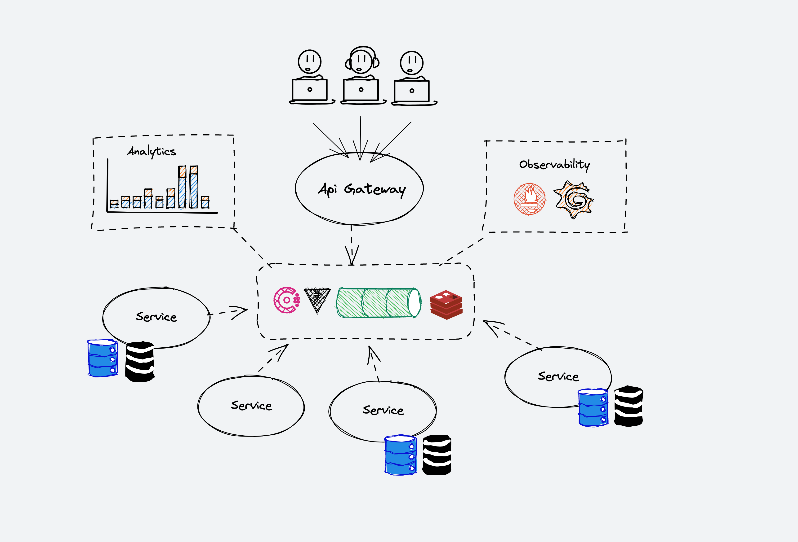
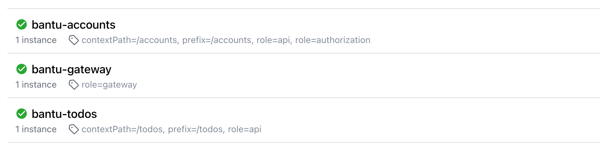

# Introduction

Bantu est un catalogue de services mis à la disposition des entreprises pour permettre à leurs équipes de développement de se concentrer 
uniquement sur le frontend (web ou mobile).

L'offre est disponible en mode Cloud public et privé. L'architecture de la solution est modulaire en se basant sur des solutions robustes du marché
pour simplifier l'intégration en entreprise.

Tout au long de cette documentation, plusieurs exemples concrets seront apportés pour illustrer l'usage
et la valeur ajoutée de l'offre.

## Architecture de référence

Dans la conception de l'architecture, les principaux choix suivants ont été arrêtés :

### Api Gateway

- L'Api Gateway est le seul point d'entrée unique. Il n'est pas possible de consommer directement un service sans passer par l'Api Gateway.
- L'Api Gateway n'est pas une solution open-source (Kong, etc), il s'agit d'un développement propore à la solution pour servir nos besoins spécifiques

### Service Registry

- Tous les composants de la solution sont inscrits dans un service registry (Consul) 
- L'Api Gateway construit le routage sur la base des tags associés à chaque service 

### Gestion des secrets

- Tous les informations sensibles utilisées pour s'authentifier ou sécuriser des données ou communications sont stockées dans Vault
- L'authentification mutuelle entre composant se repose sur les certificats gérés par Vault

### Échanges internes

Le coeur de la communication interne entre services est le serveur de Streaming [NATS](https://nats.io/). Dans cette architecture,
la seule communication HTTP, est celle transmise par les développeurs. Toutes les autres communications sont binaires et passent
par des événements (pattern PUB/SUB). Le bus d'événements NATS et configuré pour persister les messages sur disque (Jetstream).

### Cache distributé

Toutes les données mises en cache sont par défaut distribuées à travers un cluster Redis.

### Persistence 

Le seule SGABD utilisé dans l'architecture est PostgreSQL avec un système de migration automatique des schémas de données.

### Multitenancy

Bantu est avant tout une offre de type SaaS. Quel que soit le mode d'hébergement, public ou privé, vous pouvez disposez
de plusieurs "clients" différents ayant chacuns leurs données séparées les uns des autres.

### Observabilité 

La solution est développée en mettant l'observabilité et les métriques au premier rang avec une intégration bas niveau
avec les solutions InfluxDB, Prometheus, Grafana, Loki et Alertmanager.

## Référence d'API

L'API Bantu est organisée autour de [REST](https://en.wikipedia.org/wiki/Representational_state_transfer).
Notre API suit une nomenclature intuitive, accepte des contenus de messages en JSON, retourne des réponses JSON et
utilise les codes HTTP standards: [httpstatuses.com](https://httpstatuses.com).

!!!
Une version GraphQL de l'API sera mise à diposition dans un futur proche.
!!!

L'API Bantu peut être, en tout temps, utilisée en mode test pour ne pas affecter vos données de production (live).
Une séparation physique des données est mise en place. La clé d'API utilisée permet d'identifier l'environnement actif.

## Authentification

À l'exception d'un nombre très réduit d'opérations, l'API Bantu requiert une authentification de type `Account` ou de type `Application`.
La section suivante vous explique plus en détails comment créer et utiliser ces deux types de clés d'API.

Une clé d'API liée à un environnement de test contiendra toujours le suffixe `_test` par opposition à `_live` pour votre environnement de production.

Nous rappelons l'important de toujours bien conserver de façon sécurisés ces clés d'APIs.

Le mode d'authentification `Basic` est utilisé au niveau de l'API.

Toutes les requêtes doivent être effectuées en mode HTTPS. Tout appel HTTP est automatiquement rejeté.