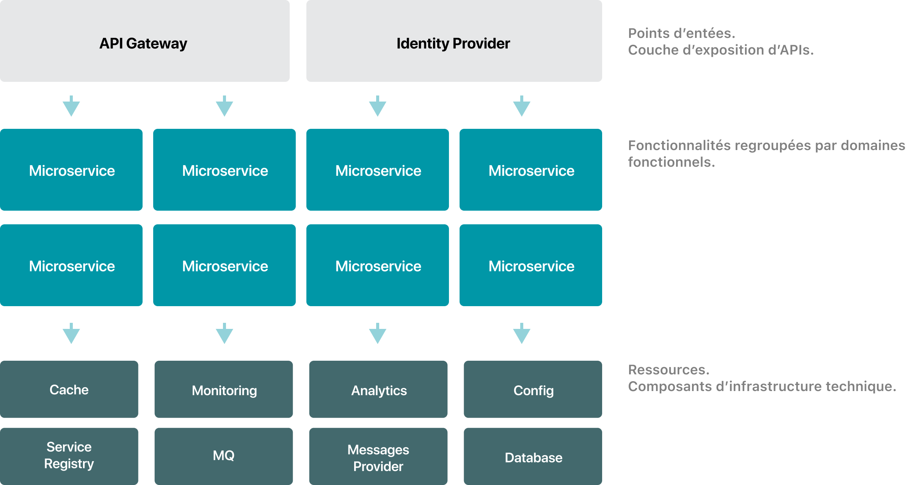

# Introduction

Bantu est une offre (<em>Backend As A Service</em>) permettant aux développeurs de créer certaines solutions plus simplement en se basant sur
un catalogue de services.

Cette offre permet de ne pas réinventer la roue à plusieurs égards tout en offrant une certaine flexibilité  pour des besoins spécifiques
même si tout est fait pour réduire ces scénarios.

Tout au long de cette documentation (orientée développeurs), plusieurs exemples concrets seront apportés pour illustrer l'usage
et la valeur ajoutée de l'offre.

## Architecture

Ci-après la version actuelle de l'architecture :

| Composant             | Implémentation                                |
|--------------         |-----------                                    |
| BD                    | PostgreSQL                                    |
| Cache                 | Redis                                         |
| Monitoring            | Grafana, Prometheus, Alertmanager, Loki       |
| Analytics             | InfluxDB, Prometheus                          |
| Config                | Vault                                         |
| Service Registry      | Consul                                        |
| Streaming             | NATS.io                             |
| Messages Provider*    | Offre cloud (Twilio) - Offre hébergée (varie) |

