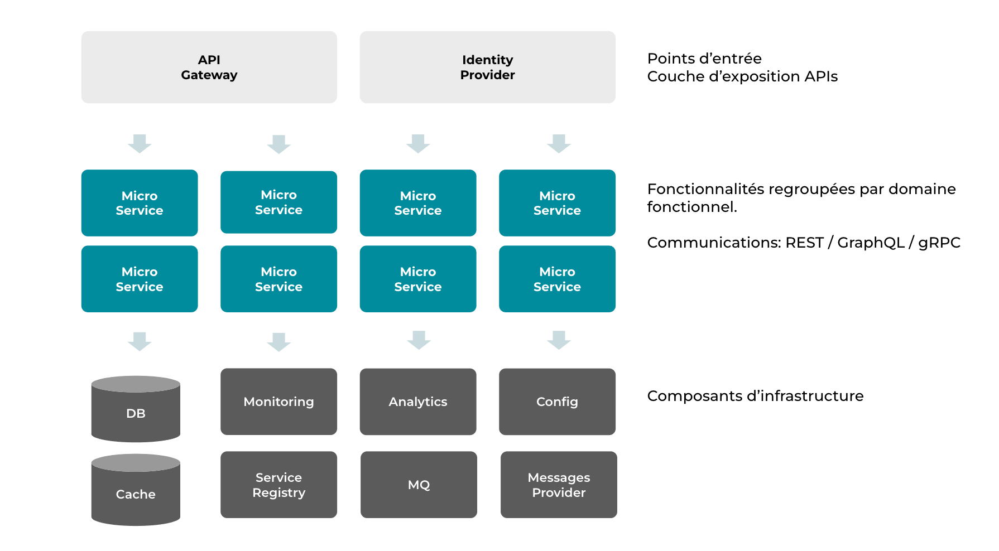

# Introduction

Bantu est un socle de services et d'APIs permettant aux développeurs et entreprises de créer des solutions pour leurs
clients finaux.
Ce socle vous permet de ne pas réinventer la roue à plusieurs égards tout en offrant la flexibilité nécessaire pour
vos besoins spécifiques.

Tout au long de cette documentation développeurs, plusieurs exemples concrets seront apportés pour illustrer l'usage
et la valeur ajoutée d'utiliser Bantu.

## Fondamentaux

Bantu est une solution qui combine des solutions open-sources et du développement interne. Tous les développements que
nous faisons sont essentiellement en Java pour permettre à la plupart des entreprises et développeurs que nous ciblons
d'étendre la solution.

## Architecture

Ci-après la version actuelle de l'architecture :

| Composant             | Implémentation                                |
|--------------         |-----------                                    |
| BD                    | PostgreSQL                                    |
| Cache                 | Redis                                         |
| Monitoring            | Grafana, Prometheus, Alertmanager, Loki       |
| Analytics             | InfluxDB, Prometheus                          |
| Config                | Vault                                         |
| Service Registry      | Consul                                        |
| MQ                    | RabbitMQ, NATS.io                             |
| Messages Provider*    | Offre cloud (Twilio) - Offre hébergée (varie) |

